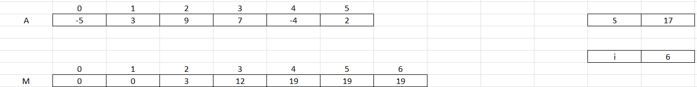
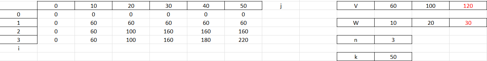
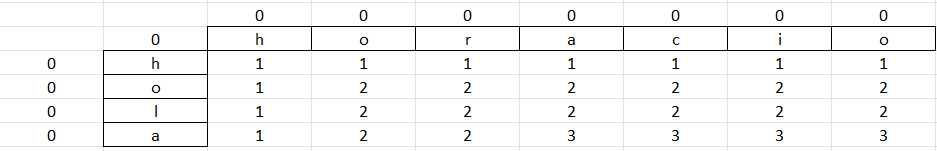

# Repaso parcial final analisis de algoritmos

# Definiciones
- **Overlapping subproblem:** Se refiere a overlapping subproblem a la utilizacion y reutilizacion de un subproblema previamente resuelto para buscar una solucion eventual de un problema mayor, es decir la repeticion de subprocesos dentro de un proceso principal.
- **Substructure optimization:** Se define a substructure optimization a la generacion de respuestas parciales en alguna parte del proceso que puedan aportar a la respuesta final.
- **Importancia de la recursion:** Para la correcta presentacion computacional de multiples aspectos de la realidad.
- **Memorization:** Tecnica de optimizacion para acelerar tiempos de espera, almacenando datos en una subrutina.
- **Si un algoritmo cumple con overlapping subproblem y substructure optimization es DP.**
- **Los problemas de DP son problemas de optimizacion (Valor maximo o minimo).**
- **En una comparacion entre DP y Memorization es mejor DP en la mayoria de casos.**

#

# The big four
## MAX 1D RANGE SUM
Se busca encontrar el intervalo de sumas mayor de un conjunto de datos de la forma [i,j].
```c++
#include <iostream>

using namespace std;

int max_1d_range_sum(int* A, int n){
    int M[n+1], S = 0;

    M[0] = 0;
    for(int i = 1; i <= n; i++){
        S = max( S + A[i-1], A[i-1] );
        M[i] = max( S, M[i-1] );
    }

    return M[n];
}

int main(void){
    int n = 8;
    int A[n] = {-2,1,-3,4,-1,2,1,-5,4};

    cout << "El resultado máximo es: " << max_1d_range_sum(A, n) << ".\n";

    return 0;
}
```



## 0/1 KNAPSACK
Se busca el mayor numero de elementos dado un limite fijo, en caso de ser posible un valor igual al limite, se retorna, en caso de no ser igual, implica que no es posible.
```c++
#include <iostream>

using namespace std;

int knapsack(int K, int* V, int* W, int n){
    int M[n+1][K+1];

    for(int i = 0; i <= n; i++)
        M[i][0] = 0;

    for(int j = 1; j <= K; j++)
        M[0][j] = 0;

    for(int i = 1; i <= n; i++)
        for(int j = 1; j <= K; j++)
            if( j >= W[i-1] )
                 M[i][j] = max( V[i-1] + M[i-1][j-W[i-1]], M[i-1][j]);
            else M[i][j] = M[i-1][j];

    return M[n][K];
}

int main(void){
    int n = 3, K = 50;
    int V[n] = {60,100,120}, W[n] = {10,20,30};

    cout << "El valor máximo que se puede obtener es: " << knapsack(K, V, W, n) << ".\n";

    return 0;
}
```


## LCS
Se busca el tamaño de la mayor subsecuencia posible de la cadena "A" dentro de la cadena "B" sin necesidad de que los caracteres esten uno seguido de otro.
```c++
#include <iostream>

using namespace std;

int LCS(string A, string B){ 
    int nA = A.length(), nB = B.length();
    int M[nA+1][nB+1];

    for(int i = 0; i <= nA; i++)
        M[i][0] = 0;
    for(int j = 1; j <= nB; j++)
        M[0][j] = 0;

    for(int i = 1; i <= nA; i++)
        for(int j = 1; j <= nB; j++)
            if( A[i-1] == B[j-1] )
                M[i][j] = 1 + M[i-1][j-1];
            else
                M[i][j] = max( M[i-1][j] , M[i][j-1] );

    return M[nA][nB];
}

int main(void){
    string S1 = "stone", S2 = "longest";

    cout << "La longitud de la Longest Common Subsequence es: " << LCS(S1, S2) << ".\n";

    return 0;
}
```



# LCS PENDIENTE
```c++
#include <iostream>

using namespace std;

bool compareStrings(string a, string b){
    if(a.length() != b.length())
        return false;

    for(int i = 0; i < a.length(); i++){
        if(a[i] != b[i])
            return false;
    }

    return true;
}

int countWords(string text){
    int n = text.length();
    int count = 0;
    for(int i = 0; i < n; i++){
        if(text[i] == ' ')
            count++;
    }
    return count+1;
}

void getWordPositions(string text, int* positions){
    int n = text.length();

    int j = 0;
    for(int i = 0; i < n; i++)
        if(text[i] == ' ' || text[i] == '\n')
            positions[j++] = i;

    positions[j] = n;
}

string getWord(string text, int n, int* wordPositions){
    int start = 0;
    if(n != 0)
        start = wordPositions[n-1]+1;
    int end = wordPositions[n];

    string word = "";

    for(int i = start; i < end; i++){
        word += text[i];
    }

    return word;
}


string lcsWords(string a, string b){
    int n = countWords(a);
    int m = countWords(b);

    int wordPositionsA[n];
    int wordPositionsB[m];

    getWordPositions(a, wordPositionsA);
    getWordPositions(b, wordPositionsB);


    int M[n+1][m+1];
    string S[n+1][m+1];

    for(int i = 0; i <= n; i++){
        M[i][0] = 0;
        S[i][0] = "";
    }

    for(int j = 1; j <= m; j++){
        M[0][j] = 0;
        S[0][j] = "";
    }

    for(int i = 1; i <= n; i++){
        for(int j = 1; j <= m; j++){
            string wordA = getWord(a, i-1, wordPositionsA);
            string wordB = getWord(b, j-1, wordPositionsB);

            if(compareStrings(wordA, wordB)){
                M[i][j] = 1 + M[i-1][j-1];
                S[i][j] = S[i-1][j-1] + wordA + " ";
            } else {
                M[i][j] = max(M[i-1][j], M[i][j-1]);
                if(M[i-1][j] > M[i][j-1])
                    S[i][j] = S[i-1][j];
                else
                    S[i][j] = S[i][j-1];
            }
        }
    }

    return S[n][m];

}


int main(){

    string C = "die einkommen der landwirte sind fuer die abgeordneten ein buch mit sieben siegeln um dem abzuhelfen muessen dringend alle subventionsgesetze verbessert werden";

    string D = "die steuern auf vermoegen und einkommen sollten nach meinung der abgeordneten nachdruecklich erhoben werden dazu muessen die kontrollbefugnisse der finanzbehoerden dringend verbessert werden";

    int* wordPositions = new int[countWords(C)];
    getWordPositions(C, wordPositions);

    cout << lcsWords(C, D) << endl;
}
```


